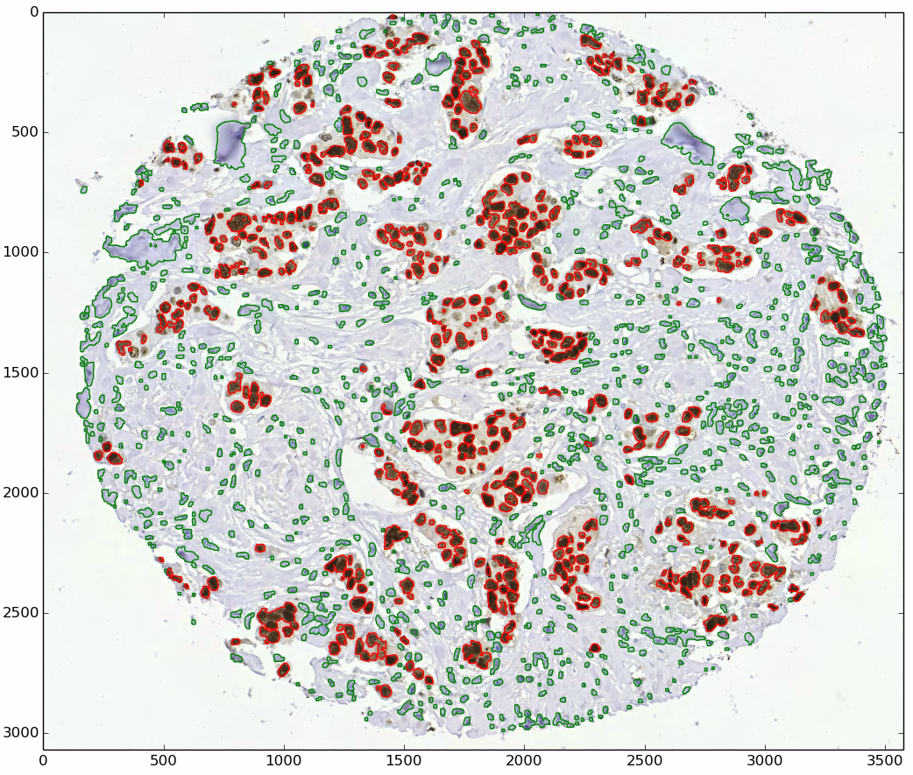

# Cell segmentation

The project aimed to develop an image processing utility for automatic segmentation of malignant and healthy cells in medical images of breast tissue. The detection results can be used to estimate the ratio of cancer cells to the total estimated number of cells in a sample tissue sample. See the sample detection result in the figure to the right of the text. See more information about the image processing method involved in the [main Python sript](cell_segmentation.py)
